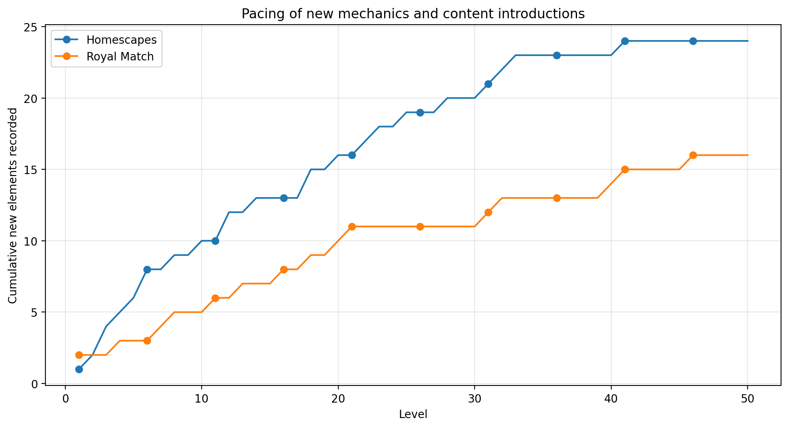
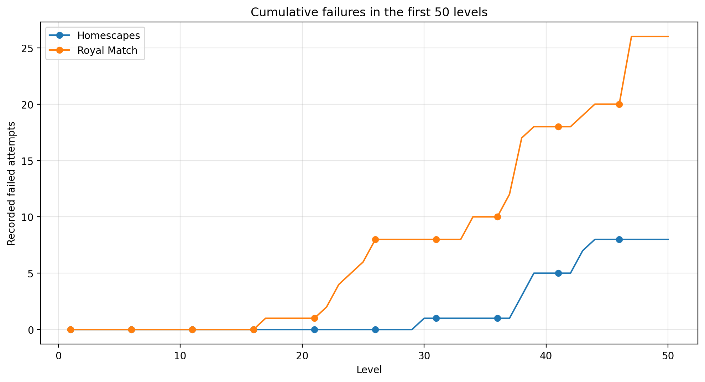
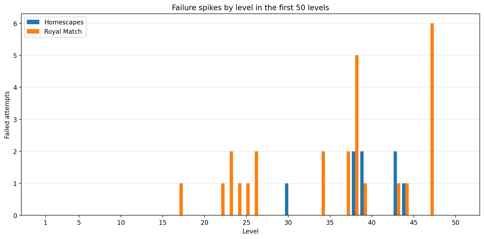

# Early Retention Loop in Homescapes and Royal Match -- Comparative Analysis

## 1. Цель анализа

В этом документе будет описано и проанализировано как Homescapes и Royal Match удерживают игрока в ранней стадии игры через сочетание следующих элементов:

-   onboarding новых механик;
    
-   выдача наград;

-   безлимитные жизни;
    
-   бустеры и инструменты;
    
-   кривая сложности;
    
-   дополнительные события и внешний прогресс.
    

Фокус будет сделан не только на различиях между играми, но и на том, как конкретные решения геймдизайна влияют на мотивацию игрока продолжать играть после побед, поражений и получения наград.

## 2. Объект сравнения

-   **Homescapes** — прогресс до уровня 200
    
-   **Royal Match** — прогресс в раннем сегменте игры, до 50 уровня
    

Основная рассмотренная механика:

> **Удержание игрока через reward loop, кривую сложности и систему компенсации поражений**

Под reward loop понимается цикл:

> прохождение уровня → получение награды → усиление ощущения прогресса → мотивация пройти следующий уровень

## 3. Краткий вывод

Homescapes создаёт мягкий и устойчивый игровой опыт. Игра постепенно вводит новые цели, препятствия, бустеры и инструменты а так же часто компенсирует сложность наградами и регулярно создаёт ощущение внешнего прогресса через сюжет, мини-ивенты, экспедиции и сундуки.

Royal Match быстрее переходит к ощутимому давлению на игрока. Уже в раннем сегменте появляются серии поражений, при этом компенсация в виде безлимитных жизней и дополнительных источников прогресса практически отсутствуют. Это ведёт к тому, что поражение воспринимается не как часть челленджа, а как фрустрация.

Ключевое различие:

> **Homescapes использует награды и внешний прогресс, чтобы сгладить сложность. Royal Match создаёт сложность начиная с более ранних этапов, но не всегда даёт достаточно эмоциональной компенсации для позитивного закрепления.**

## 4. Onboarding и темп введения механик

### Homescapes

Homescapes постепенно вводит игрока в базовые match-3 механики. Первые уровни последовательно знакомят с основными бустерами:

-   ракета;
    
-   бомба;
    
-   планер;
    
-   шар.
    

После этого игра начинает добавлять новые цели и ограничения: ковёр, цепи, желе, вишни, пончики, коробки, печенье и другие элементы. Новые механики появляются регулярно, но не перегружают игрока сразу.

Важное наблюдение: игра часто даёт игроку достаточно ходов на ранних уровнях. Это создаёт ощущение контроля и успеха. Игрок, изучая механику, почти гарантированно получает позитивное подкрепление.

### Royal Match

Royal Match сразу даёт игроку доступ к match-3 loop без последовательных туторов, поэтому onboarding ощущается менее мягким. Бустеры можно создавать уже в начале, но не всегда через явный туториал. Новые цели появляются быстро: коробки, трава, тарелки, конверты, яйца, бутылки с зельями. При этом комбинации разных целей иногда выглядят несбалансировано, что часто ведёт к поражениям и фрустрации игрока.

Уже в раннем сегменте появляются серии поражений. Например, заметные проблемы начались примерно после уровней 17–25, а затем усилились на уровнях 34–47. Это создаёт ощущение более резкого скачка сложности которые очень часто создают чувство несправедливо усложнённых уровней.

### Сравнительный график

## 5. Reward loop и безлимитные жизни

### Homescapes

Homescapes очень активно использует награды как инструмент удержания. В ходе прохождения регулярно выдавались:

-   сундуки;
    
-   бустеры;
    
-   инструменты;
    
-   безлимитные жизни на 15, 30 или 45 минут;
    
-   бонусы через дополнительные события;
    
-   награды через экспедиции и сюжетный прогресс;

-   приятные бонусы за прохождение сезонного пропуска

Особенно сильный элемент — достаточно частая выдача безлимитных жизней. Она работает сразу в двух направлениях:

1.  снижает страх проигрыша;
    
2.  создаёт давление продолжать играть, пока таймер активен.
    

Это удачное retention решение. Игрок получает ощущение щедрости, но одновременно попадает в ситуацию в психологическую ситуацию где ему необходимо использовать полученное время пока оно не закончилось. Это создаёт давление, не всегда приятное, но точно ощутимое.

Дополнительно Homescapes поддерживает мотивацию через накопленные звёзды. Даже если игрок устал от match-3 уровней, у него остаётся отдельный слой прогресса — сюжет, ремонт дома и режим экспедиции. Это снижает монотонность.

### Royal Match

Royal Match тоже выдаёт награды, инструменты и сундуки, однако по ощущениям экономика заметно менее щедрая в отношении безлимитных жизней, которые в большинстве своём доступы исключительно через платный сезонный пропуск. Остальные награды чаще воспринимаются как полезные, но не как полноценная компенсация за серию поражений. Впрочем даже эти инструменты зачастую не облегчают процесс геймплея и пригождаются лишь в ограниченном числе игровых ситуаций.

В результате поражения сильнее бьют по мотивации. Если игрок проигрывает несколько раз подряд и не получает достаточно внешнего прогресса или компенсации, игра начинает восприниматься не как челлендж, а как препятствие.

## 6. Кривая сложности и фрустрация

### Homescapes

В Homescapes первые значимые поражения появились не сразу. Игра постепенно повышала сложность, чередуя обычные уровни, hard/super hard уровни, новые препятствия, награды и время от времени разбавляя геймплей лёгкими мини пазлами.

Даже когда появлялись сложные уровни, игра часто компенсировала их через:

-   безлимитные жизни;
    
-   сундуки;
    
-   бустеры;
    
-   инструменты;
    
-   one-shot бонусы;
    
-   события.
    

Это создаёт более мягкую кривую сложности. Игрок может проигрывать, но не ощущает, что прогресс полностью остановился.

### Royal Match

В Royal Match фрустрация появилась раньше. Уже в раннем сегменте наблюдались частые поражения на отдельных уровнях. Особенно заметными были серии проигрышей на уровнях 23–26, 34–39 и 47.

Проблема не только в сложности, а в сочетании факторов:

-   меньше ощущения внешнего прогресса;
    
-   меньше эмоциональной компенсации после поражений;
    
-   меньше разнообразия вне основного match-3 поля;
    
-   субъективное ощущение менее динамичной генерации фигур;
    
-   отдельные цели и препятствия воспринимаются менее предсказуемо.
    

Из-за этого игрок чувствует несправедливую сложность которую создаёт против него игра. Как уже было указано ранее -- часто серия поражений продолжается несмотря на использование сторонних бустеров и инструментов а отсутствие вменяемой компенсации необычайно фрустирует игрока.

### Сравнительные графики

## 7. Внешний прогресс и дополнительные активности

### Homescapes

Одно из сильнейших преимуществ Homescapes — наличие нескольких параллельных источников мотивации:

-   основной match-3 прогресс;
    
-   сюжет;
    
-   ремонт и кастомизация;
    
-   экспедиции;
    
-   мини-уровни;
    
-   временные события;
    
-   сундуки и награды.
    

Это снижает усталость от основного геймплея. Даже простые мини-уровни, которые проходятся за несколько секунд, выполняют важную функцию: они разбавляют ритм и дают игроку короткую эмоциональную паузу.

### Royal Match

Royal Match делает больший акцент на основном match-3 процессе. Дополнительные режимы вроде King’s Nightmare присутствуют, но в наблюдаемом сегменте они не создавали такого же устойчивого ощущения внешнего прогресса, как сюжет и события в Homescapes.

Из-за этого игра ощущается более сухой: если игрок застрял на уровне, у него меньше альтернативных источников удовольствия и прогресса.

## 8. Игровое ощущение и feedback

### Homescapes

Homescapes ощущается более отполированной:

-   приятный визуальный стиль;
    
-   плавные анимации;
    
-   хорошая тактильная отдача;
    
-   понятная система комбинаций и регистрации урона;
    
-   более живой темп на игровом поле;
    
-   наличие персонажей и повествования.
    

Отдельное наблюдение: шар не всегда убирает все фигуры одного цвета, если активировать его во время падения новых фигур. В таком случае исчезают только те элементы, которые уже успели появиться на поле. Это может быть логически объяснимо, но с точки зрения игрока способно выглядеть как неполное срабатывание, не обязательно баг.

### Royal Match

В Royal Match визуальный стиль субъективно воспринимается менее выразительным. Цвета выглядят более тусклыми, а игровой процесс менее динамичным.

Положительное отличие: шар активирует фигуры выбранного цвета даже в момент их падения; Комбинация шара и бомбы активирует разбросанные бустеры одновременно, это создаёт более сильное ощущение мощности бустера.

Однако часть правил взаимодействия фигур воспринималась менее очевидно. Например, при сборе match-3 рядом с контейнером зелий урон наносился не всегда так, как ожидалось. Это может быть связано с конкретной логикой клетки, направления свайпа или зоны воздействия, но для игрока такое поведение ощущается непредсказуемо.

## 9. Что Homescapes делает лучше

Homescapes лучше справляется с ранним удержанием за счёт комбинации нескольких решений:

1.  **Мягкий onboarding.** Новые механики вводятся постепенно и сопровождаются ранними победами.
    
2.  **Щедрая экономика наград.** Игрок регулярно получает сундуки, бустеры, инструменты и безлимитные жизни.
    
3.  **Сильная компенсация поражений.** Даже при проигрышах игрок не чувствует полной остановки прогресса.
    
4.  **Внешний прогресс.** Сюжет, ремонт, экспедиции и мини-ивенты дают мотивацию вне самих уровней.
    
5.  **Общая отполированность.** Анимации, визуал и тактильная отдача усиливают ощущение качества.
    

## 10. Что Royal Match делает лучше

Несмотря на более фрустрирующий ранний опыт, у Royal Match есть сильные стороны:

1.  **Быстрый вход в core gameplay.** Игра почти сразу переводит игрока к match-3 процессу.
    
2.  **Чистый фокус на уровнях.** Меньше отвлечений, больше концентрации на puzzle gameplay.

3.  **Более ранний челлендж.** Для части аудитории быстрый рост сложности может быть мотивирующим.
    

Проблема Royal Match не в наличии сложности как таковой, а в том, что ранняя сложность не всегда достаточно компенсируется наградами, внешним прогрессом и эмоциональной разрядкой.

## 11. Что можно улучшить

### Для Homescapes

1.  **Сделать поведение шара более прозрачным.** Если шар не затрагивает падающие фигуры, это можно объяснить визуально или технически улучшить.
    
2.  **Сохранять баланс щедрости.** Безлимитные жизни хорошо удерживают, но при слишком частой выдаче могут создавать чрезмерное давление и усталость.
    
3.  **Продолжать чередовать сложные уровни с короткими reward moments.** Это помогает удерживать игрока после hard/super hard уровней.
    

### Для Royal Match

1.  **Смягчить ранние скачки сложности.** Серии поражений в первых 50 уровнях могут появляться слишком рано.
    
2.  **Усилить компенсацию после проигрышей.** Например, чаще давать временные бонусы, частичный прогресс или небольшие награды.
    
3.  **Добавить больше внешнего прогресса.** Игроку нужен источник мотивации вне самого уровня, особенно когда он застрял.
    
4.  **Сделать правила взаимодействия более очевидными.** Поведение препятствий и зон урона должно считываться без ощущения случайности.
    
5.  **Усилить визуальную и тактильную отдачу.** Это может снизить ощущение сухости и повысить удовлетворение от успешных ходов.
    

## 12. Финальный вывод

В раннем удержании Homescapes выглядит сильнее за счёт более мягкого баланса между сложностью, наградами и внешним прогрессом. Игра не просто предлагает игроку проходить уровни, а постоянно создаёт дополнительные причины остаться: сюжет, ремонт, события, экспедиции, сундуки и безлимитные жизни.

Royal Match больше концентрируется на основном match-3 геймплее, но при этом раньше создаёт фрустрацию. Если игрок сталкивается с серией поражений без достаточной компенсации, мотивация продолжать снижается.

С точки зрения геймдизайна, Homescapes лучше удерживает игрока за счёт многообразности возможных активностей а так же более щедрого поощрения за успехи и более смягчающих компенсаций за поражение

Именно это делает геймплей Homescapes более устойчивым и менее фрустрирующим.

## Приложение
Все сходные таблицы доступны [тут](https://docs.google.com/spreadsheets/d/1IvkTWCZZcNL0_Yl1Pb1rvMkpUnEKI0hBorZD9XSd_Zk/edit?usp=sharing) или в файлах репозитория.
